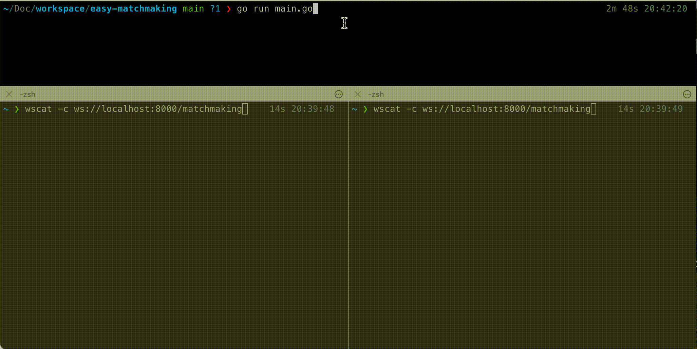

# P2P-MatchMaking ⚡️

Un serveur WebSocket simple écrit en Go, dédié au matchmaking 1-contre-1 en temps réel.

## Démo 🛜


Exemple de deux clients WebSocket appariés en temps réel dans la même salle.

## Utilisation 🧑‍💻

Démarrer le serveur (port d’écoute par défaut : 8000, modifiable via `--port`) :
```bash
go run ./main.go
```

Préparez deux clients WebSocket et connectez-les au serveur.

Exemple avec [wscat](https://github.com/websockets/wscat):
```bash
$ wscat -c ws://localhost:8000/matchmaking
Connected (press CTRL+C to quit)
> {"user_id": "test-user1", "created_at": "2099-12-31T23:59:58+00:00"}
# si une correspondance est trouvée :
< {"type":"MATCH","room_id":"68be89f","user_id":"test-user2","created_at":"2024-05-29T20:43:03.897592+09:00"}
```

Exécuter avec Docker :
```bash
docker build -t p2p-matchmaking .
docker run --rm -p 8000:8000 \
  -e SLACK_WEBHOOK_ENDPOINT='https://hooks.slack.com/services/XXX/YYY/ZZZ' \
  p2p-matchmaking
```

## Protocole WebSocket 📡

Requête (depuis le client) :
```json
{
  "user_id": "user123",
  "created_at": "2025-08-08T00:00:00Z"
}
```

Réponse (du serveur) :
```json
{
  "type": "MATCH",
  "room_id": "abc1234",
  "user_id": "user456",
  "created_at": "2025-08-08T00:00:01Z"
}
```

## Variable d’environnement 🍩
| KEY | Description |
| --- | --- |
|`SLACK_WEBHOOK_ENDPOINT` | Si vous spécifiez un endpoint Webhook Slack, un message sera envoyé lorsqu’un utilisateur entre. |
