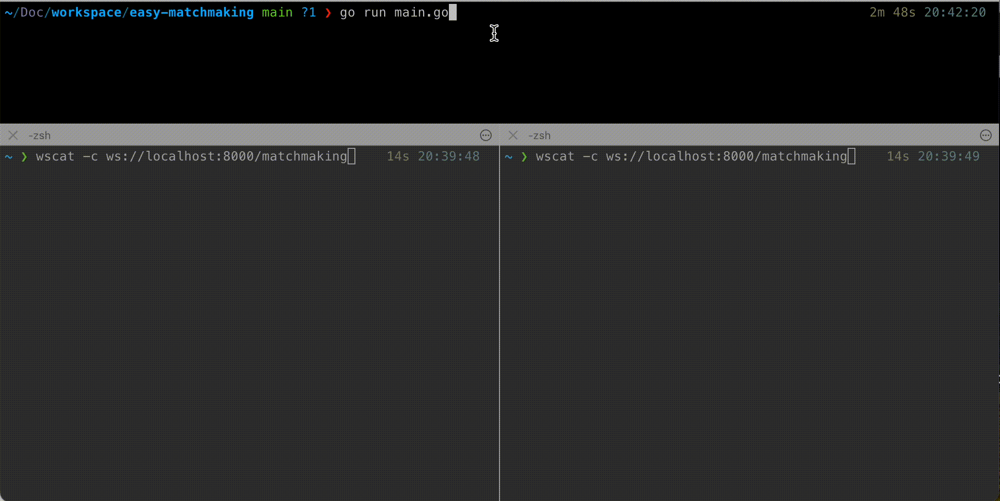

# P2P-MatchMaking ⚡️

Goで実装された、リアルタイムで1対1のマッチメイキングを行うシンプルなWebSocketサーバーです。

## Demo 🛜


2つのWebSocketクライアントがリアルタイムで同じルームにマッチングされる例です。

## Usage 🧑‍💻

サーバー起動（デフォルト待ち受けポート: 8000、`--port` フラグで変更可能）
```bash
go run ./main.go
```

2つのWebSocketクライアントを用意してサーバーに接続します。

[wscat](https://github.com/websockets/wscat)を使った例:
```bash
$ wscat -c ws://localhost:8000/matchmaking
Connected (press CTRL+C to quit)
> {"user_id": "test-user1", "created_at": "2099-12-31T23:59:58+00:00"}
# マッチングが成立した場合:
< {"type":"MATCH","room_id":"68be89f","user_id":"test-user2","created_at":"2024-05-29T20:43:03.897592+09:00"}
```

Dockerで実行する場合:
```bash
docker build -t p2p-matchmaking .
docker run --rm -p 8000:8000 \
   -e SLACK_WEBHOOK_ENDPOINT='https://hooks.slack.com/services/XXX/YYY/ZZZ' \
   p2p-matchmaking
```

## WebSocket Protocol 📡

クライアントからのリクエスト:
```json
{
  "user_id": "user123",
  "created_at": "2025-08-08T00:00:00Z"
}
```

サーバーからのレスポンス:
```json
{
  "type": "MATCH",
  "room_id": "abc1234",
  "user_id": "user456",
  "created_at": "2025-08-08T00:00:01Z"
}
```

## Environment Variable 🍩
| KEY | Description |
| --- | --- |
|`SLACK_WEBHOOK_ENDPOINT` | SlackのWebhookエンドポイント(環境変数)を指定すると、ユーザーが入室したタイミングでSlackに通知が送信されます。 |
